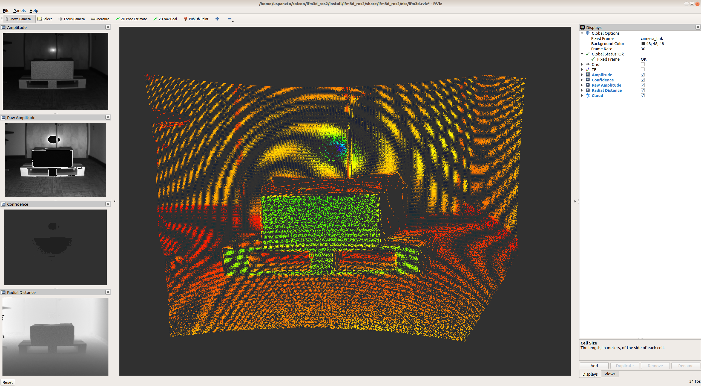

ifm3d-ros2
==========
`ifm3d-ros2` is a wrapper around [ifm3d](https://github.com/lovepark/ifm3d)
enabling the usage of ifm pmd-based ToF cameras from within
[ROS 2](https://index.ros.org/doc/ros2/) software systems.



Software Compatibility Matrix
=============================
<table>
  <tr>
    <th>ifm3d-ros2 version</th>
    <th>ifm3d version</th>
    <th>ROS 2 distribution(s)</th>
  </tr>
  <tr>
    <td>0.1.0</td>
    <td>0.12.0</td>
    <td>Dashing</td>
  </tr>
  <tr>
    <td>0.1.1</td>
    <td>0.12.0, 0.13.0</td>
    <td>Dashing</td>
  </tr>
  <tr>
    <td>0.2.0</td>
    <td>0.12.0, 0.13.0</td>
    <td>Dashing</td>
  </tr>
  <tr>
    <td>0.3.0</td>
    <td>0.17.0</td>
    <td>Dashing, Eloquent</td>
  </tr>
</table>

Building and Installing the Software
====================================

### Pre-requisites

1. [ROS2](https://index.ros.org/doc/ros2/Installation/)
2. [ifm3d](https://github.com/ifm/ifm3d)

In addition to the base packages found in `ros-*-desktop-full` you will need
the following ROS packages:

- cv_bridge
- vision_opencv
- launch_testing
- launch_testing_ament_cmake

On debian based systems they may be installed as follows (replacing `eloquent`
with your target ROS2 disto)
```
$ sudo apt install ros-eloquent-cv-bridge ros-eloquent-vision-opencv \
    ros-eloquent-launch-testing ros-eloquent-launch-testing-ament-cmake
```

### Building from source

`ifm3d-ros2` is intended to be built with
[colcon](https://colcon.readthedocs.io/en/released/user/quick-start.html#build-ros-2-packages.)
To that end, the shell commands below assume a single colcon workspace in which
`ifm3d-ros2` will be built.

Create the colcon workspace:
```
$ mkdir ~/colcon/ifm3d_ros2/src
```

Clone the `ifm3d-ros2` github repo into this workspace and build it:

(NOTE: the `--cmake-args -DBUILD_TESTING=ON` part of the `colcon` command below
is not strictly necessary (tests are `ON` by default), however, it is explicit
(see: `python3 -mthis`)).
```
$ cd ~/colcon/ifm3d_ros2/src
$ git clone https://github.com/ifm/ifm3d-ros2.git ifm3d_ros2
$ cd ..
$ colcon build --cmake-args -DBUILD_TESTING=ON
Starting >>> ifm3d_ros2
Finished <<< ifm3d_ros2 [17.6s]

Summary: 1 package finished [17.8s]
```

Run the test suite (optional, you will need supported hardware connected):
```
$ colcon test
$ colcon test-result --all
[ ... output omitted ... ]
```

Launch the camera node (assuming you are in `~/colcon/ifm3d_ros2`):
```
$ . install/setup.bash
$ ros2 launch ifm3d_ros2 camera_managed.launch.py
```

In a new shell, to visualize the data from the camera in rviz (assuming you are in
`~/colcon/ifm3d_ros2`):
```
$ . install/setup.bash
$ ros2 launch ifm3d_ros2 rviz.launch.py
```

ROS Interface
=============

### Parameters

<table>
  <tr>
    <th>Name</th>
    <th>Data Type</th>
    <th>Default Value</th>
    <th>Description</th>
  </tr>
  <tr>
    <td>~/frame_latency_thresh</td>
    <td>float</td>
    <td>1.0</td>
    <td>
      Time (seconds) used to determine that timestamps from the camera cannot
      be trusted. When this threshold is exceeded, when compared to system
      time, we use the reception time of the frame and not the capture time of
      the frame.
    </td>
  </tr>
  <tr>
    <td>~/ip</td>
    <td>string</td>
    <td>192.168.0.69</td>
    <td>
      The ip address of the camera.
    </td>
  </tr>
  <tr>
    <td>~/password</td>
    <td>string</td>
    <td></td>
    <td>
      The password required to establish an edit session with the camera.
    </td>
  </tr>
  <tr>
    <td>~/schema_mask</td>
    <td>uint16</td>
    <td>0xf</td>
    <td>
      The schema mask to apply to the active session with the frame
      grabber. This determines which images are available for publication from
      the camera. More about schemas can be gleaned from the
      <a href="https://github.com/ifm/ifm3d">ifm3d</a> project.
    </td>
  </tr>
  <tr>
    <td>~/timeout_millis</td>
    <td>int</td>
    <td>500</td>
    <td>
      The number of milliseconds to wait for the framegrabber to return new
      frame data before declaring a "timeout" and to stop blocking on new
      data.
    </td>
  </tr>
  <tr>
    <td>~/timeout_tolerance_secs</td>
    <td>float</td>
    <td>5.0</td>
    <td>
      The wall time to wait with no new data from the camera before trying to
      establish a new connection to the camera. This helps to provide
      robustness against camera cables becoming unplugged or other in-field
      pathologies which would cause the connection between the ROS node and the
      camera to be broken.
    </td>
  </tr>
  <tr>
    <td>~/sync_clocks</td>
    <td>bool</td>
    <td>false</td>
    <td>
      Attempt to sync the camera clock to the system clock at start-up. The
      side-effect is that timestamps on the image should reflect the capture
      time as opposed to the receipt time. Please note: resolution of this
      synch is only granular to 1 second. If fine-grained image acquisition
      times are needed, consider using the on-camera NTP server (available on
      select camera models).
    </td>
  </tr>
  <tr>
    <td>~/xmlrpc_port</td>
    <td>uint16</td>
    <td>80</td>
    <td>
      The TCP port the camera's xmlrpc server is listening on for requests.
    </td>
  </tr>
</table>

### Published Topics

<table>
  <tr>
    <th>Name</th>
    <th>Data Type</th>
    <th>Quality of Service</th>
    <th>Description</th>
  </tr>
  <tr>
    <td>amplitude</td>
    <td>sensor_msgs/msg/Image</td>
    <td><a href="include/ifm3d_ros2/qos.hpp">ifm3d_ros::LowLatencyQoS</a></td>
    <td>The normalized amplitude image</td>
  </tr>
  <tr>
    <td>cloud</td>
    <td>sensor_msgs/msg/PointCloud2</td>
    <td><a href="include/ifm3d_ros2/qos.hpp">ifm3d_ros::LowLatencyQoS</a></td>
    <td>The point cloud data</td>
  </tr>
  <tr>
    <td>confidence</td>
    <td>sensor_msgs/msg/Image</td>
    <td><a href="include/ifm3d_ros2/qos.hpp">ifm3d_ros::LowLatencyQoS</a></td>
    <td>The confidence image</td>
  </tr>
  <tr>
    <td>distance</td>
    <td>sensor_msgs/msg/Image</td>
    <td><a href="include/ifm3d_ros2/qos.hpp">ifm3d_ros::LowLatencyQoS</a></td>
    <td>The radial distance image</td>
  </tr>
  <tr>
    <td>raw_amplitude</td>
    <td>sensor_msgs/msg/Image</td>
    <td><a href="include/ifm3d_ros2/qos.hpp">ifm3d_ros::LowLatencyQoS</a></td>
    <td>The raw amplitude image</td>
  </tr>
  <tr>
    <td>unit_vectors</td>
    <td>sensor_msgs/msg/Image</td>
    <td><a href="include/ifm3d_ros2/qos.hpp">ifm3d_ros::LatchedQoS</a></td>
    <td>The rotated unit vectors</td>
  </tr>
  <tr>
    <td>xyz_image</td>
    <td>sensor_msgs/msg/Image</td>
    <td><a href="include/ifm3d_ros2/qos.hpp">ifm3d_ros::LowLatencyQoS</a></td>
    <td>
      A 3-channel image encoding of the point cloud. Each of the three image
      channels respesent a spatial data plane encoding the x, y, z Cartesian
      values respectively.
    </td>
  <tr>
    <td>temperature</td>
    <td>sensor_msgs/msg/Temperature</td>
    <td><a href="include/ifm3d_ros2/qos.hpp">ifm3d_ros::LowLatencyQoS</a></td>
    <td>
      The temperature of the illuminators in Celcius
    </td>
  </tr>
  </tr>
</table>

### Subscribed Topics

None.

### Advertised Services

<table>
  <tr>
    <th>Name</th>
    <th>Service Definition</th>
    <th>Description</th>
  </tr>
  <tr>
    <td>Dump</td>
    <td><a href="srv/Dump.srv">ifm3d/Dump</a></td>
    <td>Dumps the state of the camera parameters to JSON</td>
  </tr>
  <tr>
    <td>Config</td>
    <td><a href="srv/Config.srv">ifm3d/Config</a></td>
    <td>
      Provides a means to configure the camera and imager settings,
      declaratively from a JSON encoding of the desired settings.
    </td>
  </tr>
</table>


Additional Documentation
========================
* [Inspecting and configuring the camera/imager settings](doc/dump_and_config.md)

TODO
====
We are currently working on rounding out the feature set of our ROS2
interface. Our current objectives are to get the feature set to an equivalent
level to that of our ROS1 interface and to tune the ROS2/DDS performance to
optimize the usage of our cameras from within ROS2 system. Thanks for your
patience as we continue to ensure our ROS2 interface is feature-rich, robust,
and performant. Your feedback on our
[issue tracker](https://github.com/ifm/ifm3d-ros2/issues) is greatly appreciated.

Please see the file called [TODO](TODO.md) for more information of what we are
currently working on.


LICENSE
=======
Please see the file called [LICENSE](LICENSE).
