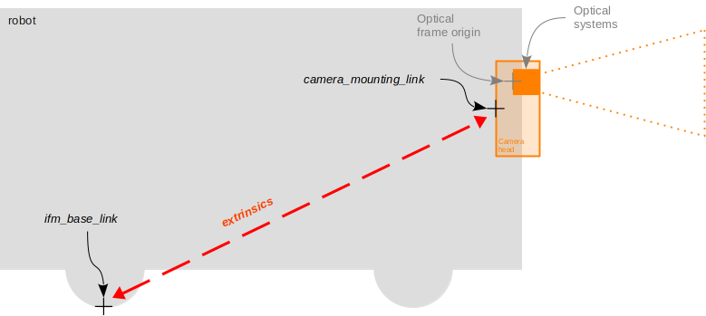
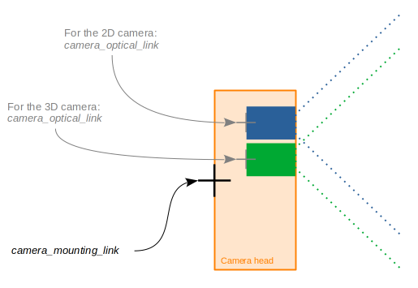

# Parameters

| Name                               | Data Type    | Default Value                                                                                                                                                                           | Description                                                                                      |
| ---------------------------------- | ------------ | --------------------------------------------------------------------------------------------------------------------------------------------------------------------------------------- | ------------------------------------------------------------------------------------------------ |
| `~/buffer_id_list`                 | string array | `{"CONFIDENCE_IMAGE", "EXTRINSIC_CALIB", "NORM_AMPLITUDE_IMAGE", "RADIAL_DISTANCE_IMAGE", "TOF_INFO", "XYZ"}` for the TOF cameras and `{"JPEG_IMAGE", "RGB_INFO"}` for the RGB cameras. | List of buffer_id strings denoting the wanted buffers.                                           |
| `~/config_file`                    | string       | `""`                                                                                                                                                                                    | Path to a JSON configuration file to be used when configuring the node.                          |
| `~/ip`                             | string       | 192.168.0.69                                                                                                                                                                            | The ip address of the camera.                                                                    |
| `~/log_level`                      | string       | warning                                                                                                                                                                                 | ifm3d-ros2 node logging level.                                                                   |
| `~/pcic_port`                      | int          | 50010                                                                                                                                                                                   | PCIC port corresponding to the targeted camera port.                                             |
| `~/tf.base_frame_name`             | string       | `ifm_base_link`                                                                                                                                                                         | Name for ifm reference frame.                                                                    |
| `~/tf.mounting_frame_name`         | string       | `<node_name>_mounting_link`                                                                                                                                                             | Name for the mounting point frame.                                                               |
| `~/tf.optical_frame_name`          | string       | `<node_name>_optical_link`                                                                                                                                                              | Name for the optical frame.                                                                      |
| `~/tf.publish_base_to_mounting`    | bool         | true                                                                                                                                                                                    | Whether the transform from the ifm base link to the camera mounting point should be published.   |
| `~/tf.publish_mounting_to_optical` | bool         | true                                                                                                                                                                                    | Whether the transform from the cameras mounting point to the optical center should be published. |
| `~/xmlrpc_port`                    | uint         | 50010                                                                                                                                                                                   | TCP port the on-camera xmlrpc server is listening on.                                            |

## Details on the published transforms

The `ifm3d-ros2` node can publish two transforms:
* one from the `ifm_base_link` to the `mounting_link`, according to the camera calibration (either via JSON or via the ifm Vision Assistant GUI),
* and one from the `mounting_link` the `optical_link`, according to the manufacturing parameters.
 
The publication of these transform can be deactivated via parameter.
The names for all three links can be changed via node parameters.

To clarify which frame each of these transform refers to, consider the drawings below:

The reference of the mounting frame is at the back of the O3R camera head housing (scale drawings can be found on ifm.com in the download section of the specific article). 
The reference for the ifm base frame is defined by the extrinsic parameters set in the JSON configuration of the O3R platform (`extrinsicHeadToUser`). 
Generally, the ifm base frame is configured to have for origin the center of the robot coordinate system, but this is not required. 
When no extrinsic parameter is set, the ifm base frame and the mounting frame are the same.

The optical frame refers to the reference point of the optical system (lens, chip, etc). 
A static transform is published between the mounting link and the optical link, that corresponds to the intrinsic calibration parameters of the camera. 
Each set of intrinsic parameters is unique to a specific camera head and set in production. These parameters are not expected to change over time.