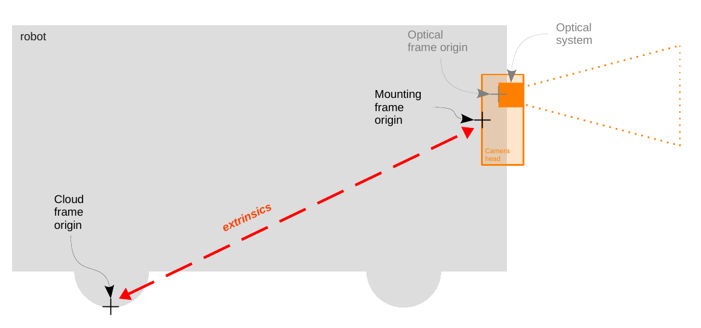
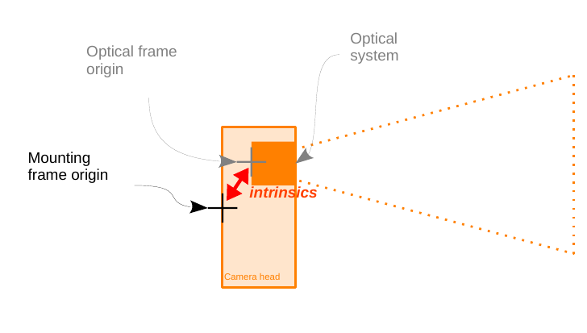

# Parameters
| Name                     | Data Type | Default Value | Description  |
| ------------------------ | --------- | ------------- | ------------ |
| ~/buffer_id_list | string array  |     {"CONFIDENCE_IMAGE","EXTRINSIC_CALIB","JPEG_IMAGE" "NORM_AMPLITUDE_IMAGE","RADIAL_DISTANCE_IMAGE","RGB_INFO","XYZ"}|  List of buffer_id strings denoting the wanted buffers.|
| ~/ip | string    | 192.168.0.69  | The ip address of the camera. |
| ~/log_level| string | warning| ifm3d-ros2 node logging level.  |
| ~/tf.cloud_link.frame_name | string |  <node_name>_optical_link | Name for the point cloud frame. |
| ~/tf.cloud_link.publish_transform | bool | true | Whether the transform from the cameras mounting point to the point cloud center should be published. |
| ~/tf.mounting_link.frame_name | string | <node_name>_mounting_link | Name for the mounting point frame. |
| ~/tf.optical_link.frame_name | string | <node_name>_optical_link | Name for the point optical frame. |
| ~/tf.optical_link.publish_transform | bool | true | Whether the transform from the cameras mounting point to the point optical center should be published. |
| ~/tf.optical_link.transform | double array | [0, 0, 0, 0, 0, 0] | Static transform from mounting link to optical link, as [x, y, z, rot_x, rot_y, rot_z] |
| ~/buffer_id_list | string array | {"NORM_AMPLITUDE_IMAGE", "CONFIDENCE_IMAGE", JPEG_IMAGE", "RADIAL_DISTANCE_IMAGE", "XYZ", "EXTRINSIC_CALIB", } | List of buffer_id strings denoting the wanted buffers. |
| ~/diag_mode | string: "async" or "periodic" | "async" | Diagnostic mode: asynchronous monitoring ("async") or periodic polling ("periodic"). |
| ~/xmlrpc_port| unint | 50010 | TCP port the on-camera xmlrpc server is listening on |

## Details on the published transforms

The ifm3d-ros2 node published three transforms: the `cloud_link`, the `mounting_link` and the `optical_link`. To clarify which frame each of these transform refers to, consider the drawings below:

The reference of the mounting frame is at the back of the O3R camera head housing (scale drawings can be found on ifm.com in the download section of the specific article). The reference for the cloud frame is defined by the extrinsic parameters set in the JSON configuration of the O3R platform (`extrinsicHeadToUser`). Generally, the cloud is configured to have for origin the center of the robot coordinate system. When no extrinsic parameter is set, the origin of the point cloud is the back of the camera head. In this case, the cloud link and the mounting link are the same.

The optical frame refers to the reference point of the optical system (lens, chip, etc). A static transform is published between the mounting link and the optical link, that corresponds to the intrinsic calibration parameters of the camera. Each set of intrinsic parameters is unique to a specific camera head and set in production. These parameters are not expected to change over time.
Note that the intrinsic parameters are split into `ExtrinsicOpticToUser` (rotations and translations of the optical system in the housing) and `Intrinsics` (specific parameters of the lens, chip, etc). For more details on the calibrations, refer to the [calibration documentation](https://ifm3d.com/latest/CalibrationRoutines/index_calibrations.html).
